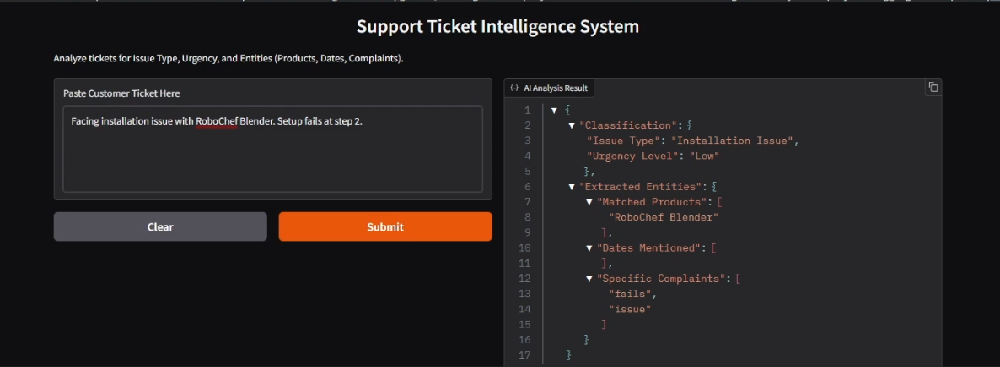

# Ticket_Text_Classification

## Customer Support Ticket Classification & Entity Extraction

---
 
---

## 🎯 Objective

To build a **traditional machine learning pipeline** that:
- Classifies customer support tickets by **issue type**
- Predicts **urgency level** (Low / Medium / High)
- Extracts key entities using **rule-based NLP**
- Provides an **interactive Gradio interface**

**Important:**  
✔ No LLMs or generative AI tools were used for Task 1, as per instructions.

---

## 📊 Dataset

- File: `ai_dev_assignment_tickets_complex_1000.xlsx`
- Contains anonymized customer support tickets with:
  - `ticket_text`
  - `issue_type` (label)
  - `urgency_level` (label)
  - `product` (ground truth entity)

---

## 🧹 Data Preparation

The following preprocessing steps were applied:
- Lowercasing text
- Removing special characters and numbers
- Tokenization
- Stopword removal
- Lemmatization
- Handling missing values

This ensures consistent and noise-free input for classical ML models.

---

## ⚙️ Feature Engineering

Traditional NLP features were used:
- **TF-IDF vectorization** for textual content
- Additional engineered features:
  - Ticket length
  - Word count
  - Sentiment polarity score

**Justification:**  
TF-IDF works well with classical ML and is interpretable.  
Sentiment and length features help improve urgency prediction.

---

## 🧠 Model Training (Multi-Task Learning)

Two **separate classical ML models** were trained:

### 1️⃣ Issue Type Classifier
- Multi-class classification
- Algorithm: Logistic Regression / SVM / Random Forest
- Evaluation: Accuracy, Precision, Recall, F1-Score

### 2️⃣ Urgency Level Classifier
- Multi-class classification (Low / Medium / High)
- Uses both TF-IDF and auxiliary features
- Evaluated using classification report and confusion matrix

---

## 🏷 Entity Extraction (Rule-Based NLP)

Entities extracted from ticket text:
- **Product names** (dictionary / list based)
- **Dates** (regex-based)
- **Complaint keywords** (e.g., broken, error, late)

Returned as a structured Python dictionary / JSON.

---

## 🔗 Integration Function

A single pipeline function takes **raw ticket text** and returns:
```json
{
"Classification":{
"Issue Type":"Installation Issue",
"Urgency Level":"Medium"
},
"Extracted Entities":{
"Matched Products":["FitRun Treadmill",
"UltraClean Vacuum",
"RoboChef Blender"],

"Dates Mentioned":["17 March"],
"Specific Complaints":["fails","issue","error"]
}
}
